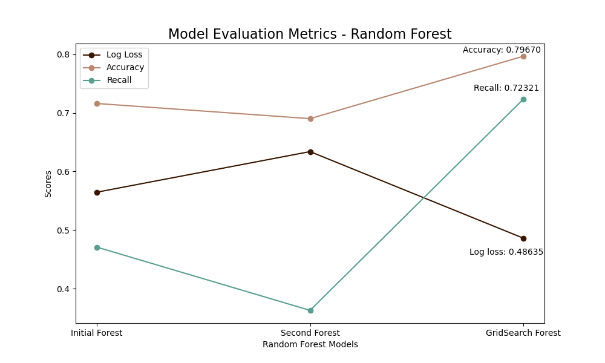
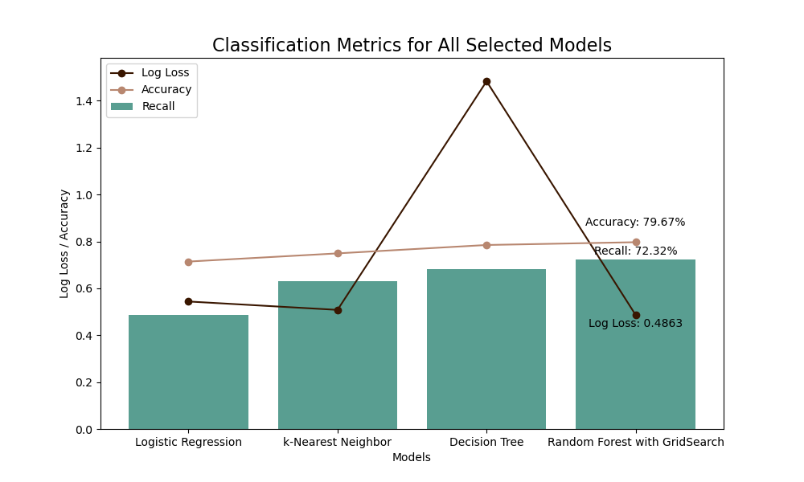

# Tanzanian Wells - Classification Modeling

<p align="center">
  
</p>

## 1. Overview

This notebook examines Tanzania's water wells, and uses classification models to predict whether a water point is non-fonctional.
The organization of this notebook follows the CRoss Industry Standard Process for Data Mining (CRISP-DM) is a process model that serves as the base for a data science process.


## 2. Business Understanding

According to a World Bank [study](https://www.worldbank.org/en/country/tanzania/publication/tanzania-economic-update-universal-access-to-water-and-sanitation-could-transform-social-and-economic-development#:~:text=Only%2061%25%20of%20households%20in,hygiene%2C%20according%20to%20SDG%20definitions), access to a basic water supply is available to just 61% of households in Tanzania, basic sanitation is accessible to 32%, and basic hygiene is within reach for less than half of households.

The country has a substantial number of existing water points, but a considerable portion of these wells either require maintenance or have completely failed, resulting in limited access to clean water.

The objective of this project is to develop a machine learning classifier that can predict if a water well in Tanzania is non functional. By analyzing various factors such as the type of pump, the quantity of water in the well and when or who installed it, we aim to categorize wells into different conditions, such as 'non functional' or 'functional'. 

This predictive model will serve as a valuable tool for organizations and non-governmental agencies involved in water resource management and infrastructure development in Tanzania.

The target audience for this project is Non-Governmental Organizations (NGOs) focusing on improving access to clean water for populations in Tanzania such as [WaterAid](https://www.wateraid.org/where-we-work/tanzania), [Charity Water](https://www.charitywater.org/our-projects/tanzania) or [Tanzania Water Project](https://www.tanzaniawaterproject.org/). 

## 3. Data Understanding

The data comes from drivendata.org, a platform which hosts data science competitions with a focus on social impact. The source of data provided by DrivenData is the Tanzanian Ministry of Water, and is stored by Taarifa. 

The actual dataset can be found [here](https://www.drivendata.org/competitions/7/pump-it-up-data-mining-the-water-table/page/23/) under the 'Data download section'. 

4 files are indicated. The below files were downloaded and renamed as follows:
- Training set values: training_set_values
- Training set labels: training_set_labels
- Test set values: test_set_values

These are the files used for the main modeling and predictive analysis. 
<br>
The test set values file is the one used to measure the accuracy of the model.

The data contains 59,400 rows and 39 feature columns with 1 id column. Here is the description of each column:

* `amount_tsh`: Total static head (amount water available to waterpoint)
* `date_recorded`: The date the row was entered
* `funder`: Who funded the well
* `gps_height`: Altitude of the well
* `installer`: Organization that installed the well
* `longitude`: GPS coordinate
* `latitude`: GPS coordinate
* `wpt_name`: Name of the waterpoint if there is one
* `num_private`: No description was provided for this feature
* `basin`: Geographic water basin
* `subvillage`: Geographic location
* `region`: Geographic location
* `region_code`: Geographic location (coded)
* `district_code`: Geographic location (coded)
* `lga`: Geographic location
* `ward`: Geographic location
* `population`: Population around the well
* `public_meeting`: True/False
* `recorded_by`: Group entering this row of data
* `scheme_management`: Who operates the waterpoint
* `scheme_name`: Who operates the waterpoint
* `permit`: If the waterpoint is permitted
* `construction_year`: Year the waterpoint was constructed
* `extraction_type`: The kind of extraction the waterpoint uses
* `extraction_type_group`: The kind of extraction the waterpoint uses
* `extraction_type_class`: The kind of extraction the waterpoint uses
* `management`: How the waterpoint is managed
* `management_group`: How the waterpoint is managed
* `payment`: What the water costs
* `payment_type`: What the water costs
* `water_quality`: The quality of the water
* `quality_group`: The quality of the water
* `quantity`: The quantity of water
* `quantity_group`: The quantity of water
* `source`: The source of the water
* `source_type`: The source of the water
* `source_class`: The source of the water
* `waterpoint_type`: The kind of waterpoint
* `waterpoint_type_group`: The kind of waterpoint


## 4. Data Preparation

### 4. a. Joining values and labels datasets together
The first step of preparing the data is to merge both df_values and df_labels, as the latter contains the target value.
Both datasets are merged on the 'id' column.

### 4. b. Data transformation & cleaning

In this section, the following was handled:
1. Missing values were verified and handled
2. Unnecessary columns were removed 
3. Transformed the classification into a binary one - which partly addressed the dataset imbalance
4. Converted other binary columns 
5. Categorized features with too many details
6. One-Hot Encoded Categorical Variables 
7. Grouped Numeric and Encoded Categorical Features 

And finally initially explored the data by visualizing box plots of a set of columns, which led to the conclusion that scaling would be required.

The below  columns were removed for the following reasons:

  1. Irrelevant for predictions (i.e. date the row was entered, waterpoint name)
  2. Contains similar information as another column (i.e. extraction_type, water_quality) 
  3. Contains information which would require additional conversion (i.e. region_code, district_code)

From 39 columns, 15 were kept: amount_tsh, funder, gps_height, installer, basin, population, public_meeting, permit, construction_year, extraction_type_class, management, quality_group, quantity, source_type, status_group.

## 5. Modeling
For each model, the same structure was followed: 
  1. A train-test split was perfromed 
  2. A baseline model was built and evaluated 
  3. Data preprocessing techniques were applied if necessary - particularly for the first model type 
  4. Additional models were built, where parameters were tuned
  5. The models were evaluated using the chosen classification metrics for this problem: recall, accuracy and log loss.  
  6. A final model was chosen  


### 5. a. Logistic Regression 

A few words about this model: <br>
Logistic regression is used for binary classification, predicting the probability of an event occurring (here, that the well is non-functional). It models the relationship between independent variables and the probability of a particular outcome, employing a logistic function to ensure predictions fall between 0 and 1. It is often used for its simplicity and interpretability.


Logistic Regression was the first model. As a consequence, more pre-processing techniques were applied:
  * Class Imbalance was addressed using SMOTE for the minority class 'non-functional' 
  * Stratified K-Fold cross validation technique was also applied to build a more robust model despite class imbalance
  * Hyperparameters were tuned: regularization was reduced and an alternative solver was applied.
  * Finally, the best number of features (45) was chosen thanks to the application of Recursive Feature Elimination technique. 

The best model was chosen from the results provided by the Recursive Feature Elimination technique.

Results for this model were as follows: 

<u>Log Loss</u>: 0.5437699554671055
The log loss is below 1 and indicate a decent accuracy in predicting probabilities and consequently, a decent model performance.

<u>Recall Score</u>: 0.4866617538688283
The true positive rate metric measuring the proportion of actual positive cases that the model correctly identifies is low. Less than 50% of positive cases were correctly identified.

<u>Accuracy Score</u>: 0.7140740740740741
The overall correctness of the model's predictions, considering both true positives and true negatives is decent: approximatively 71.41.%


### 5. b. K-Nearest Neighbors 

K-Nearest Neighbors model was the second one used to make predictions. 

A few words about this model: <br>
This model trains fast as it is optimized for quick predictions. The predictions can have lower speed due to examining all training records for k-nearest neighbors. Scaling is required for consistent distance scales and the model the key hyperparameters are n_neighbors which avoids over/under-fitting, p, and metric - which defines distance measure for neighbors.

4 models with different hyperparameters were evaluated. 
The best model chosen was based on the highest recall, when the other two parameters: accuracy and log loss also make sense. 

Results for this model were as follows:

<u>Log Loss</u>: 0.5080102239905967
The log loss is lower than the best one provided by Logistic Regression models (0.5437699554671055). The accuracy in predicting probabilities is improving.

<u>Recall Score</u>: 0.6306558585114223
The true positive rate metric has highly increased compared to the 0.4866617538688283 recorded from Logistic Regression models. The model now correctly identifies actual non-functional rates 63% of the time.

<u>Accuracy Score</u>: 0.749023569023569
The model correctly predicted close to 75% of wells' conditions. This is an improvement compared to the previously recorded 0.7140740740740741


### 5. c. Decision Trees
A few words about this model: <br>
Decision trees provide a flexible and interpretable machine learning approach, allowing various options to adapt to different datasets and objectives by fine-tuning hyperparameters.
Nevertheless, the training can be slow due to considering splits involving all features and the speed of predictions is medium-fast due to the number of conditional statements. It does not require scaling and the key hyperparameters include max_depth, min_samples_split or criteria to control overfitting.

7 models were evaluated where hyperparameters were initially modified 'manually', before applying Combinatoric Grid Searching. This evaluated the best parameters for the model. <br>

<u>Combinatoric Grid Searching</u>
Grid Search trains a model on the dataset for every distinct set of parameters, ultimately providing the configuration that produced the best-performing model. To prevent the influence of random variations, it is common practice to apply K-Fold cross-validation.


The best parameters combination found during Grid Search were as follows:
{'criterion': 'gini',
 'max_depth': 30,
 'min_samples_leaf': 4,
 'min_samples_split': 2,
 'splitter': 'random'}

Results for the best model were as follows: 

<u>Log Loss</u>: 1.4830670254136458
The log loss is much higher than the previous best model: kNN: (0.5080102239905967). The accuracy in predicting probabilities has decreased.

<u>Recall Score</u>: 0.6829771554900516
Nevertheless, the true positive rate metric has highly increased compared to the 0.6306558585114223 recorded from Logistic Regression models. The model now correctly identifies actual non-functional rates 68% of the time.

<u>Accuracy Score</u>: 0.7847811447811448
The model correctly predicted about 78% of wells' conditions. This is an improvement compared to the previously recorded 0.749023569023569


An initial evaluation of features importances were evaluated. 


### 5. d. Random Forest
Random Forest is an ensemble method that combines the strength of multiple decision trees to improve model performance, and which is effective in reducing overfitting compared to single decision trees.
The training speed is moderate due to the multiple decision trees built but the prediction speed is fast, as aggregating from multiple trees is efficient. Like Decision Trees, scaling is not required and the important hyperparameters include n_estimators, max_depth, min_samples_split, min_samples_leaf and max_features and criterion.   

As opposed to with Decision Trees, only 2 models were built manually before using Combinatoric Grid Searching to find the best hyperparameters. 


The best parameters combination found during Grid Search were as follows:
{'max_depth': 30,
 'min_samples_leaf': 1,
 'min_samples_split': 2,
 'n_estimators': 200}

<u>Log Loss</u>: 0.5998634529698249
Rhe model performance has considerably increased compared to the last model: the log loss is back to reasonable results, indicating a much better accuracy of the predicted probabilities.

<u>Recall Score</u>: 0.7227708179808401
This is the best recall score recorded. The model now correctly identifies actual non-functional wells 72% of the time.

<u>Accuracy Score</u>: 0.7965656565656566
The model correctly predicted over 79% of wells' conditions. This is the best score reached among all models as well.



## 6. Evaluation

The model that predicts the most accurately the non functional wells is the **Random Forest** where Hyperparameters were tuned thanks to Combinatorics GridSearching. The best parameters found for this model were the following:

{'max_depth': None,
 'min_samples_leaf': 1,
 'min_samples_split': 2,
 'n_estimators': 100}


All key classification metrics from the best models were stored into 3 variables so the four final models were compared.  

**Recall**

Due to the data's context, `recall`  is the important metric to report, as false negatives are a bigger problem: if a well is labeled as functional (0) when it really is non-functional (1) - in which case, it would be a false negative, the consequences would be dramatic: populations' health could be negatively impacted if they were to drink this well's water.

The highest `recall` of all models was recorded. The model correctly identified about 72% of the actual non-functional water wells in the dataset. In other words, it minimizes the chances of false negatives which is crucial as populations' healths and lives depend on the quality of the water they have access to.

Moreover, the highest `accuracy` highlighted its overall predictive power in accurately identifying wells. This indicates that the model correctly classified over 79% of all water wells.

Furthermore, as `log loss` quantifies the uncertainty associated with the model's predictions. It measures how well the model's predicted probabilities align with the actual outcomes. 
The probabilities that a well is predicted as non-funtional are the most accurate they could be.




## 7. Findings & Recommendations 

### 7. a. Model Performance
The model accurately predicts 72% of non-functional wells, and 79% of all wells.


**Confusion Matrix**

* The bottom-right value (4,886) represents the True Positives (TP): the correctly predicted non-functional wells. They represent 72% of total non-functional instances (4,886 + 1,892).   

* The bottom-left value (1,892) represents False Negatives (FN). The goal of these models was to make this value as low as possible, as it indicates the number of water wells that are non-functional, but that the model classed as functional. 
    
    This is dangerous, as lives and populations' healths may be harmed by such an error.


<u>Other metrics</u> <br>
`Recall` measures the ability to identify all actual positive instances (actual non-functional water points) while `Precision` measures the accuracy of positive predictions. This means that out of all the instances that the model predicted as non-functional water wells, 81% were actually non-functional. This indicates a relatively high accuracy of the model's predictions for non-functional water wells.


`F1` Score is a balance between precision and recall, combining both metrics.
0.76. It suggests that the model provides a reasonable compromise between making accurate positive predictions (precision) and correctly identifying all actual positive instances (recall). 

### 7. b. Most Important Features


The most important features that will help determining the most accurate predictions, whether a water well is non functional are:
1. <u>gps height</u>: the altitude of the well
2. <u>construction_year</u>: the year the waterpoint was constructed 
3. <u>population</u>: the population around the well 
4. <u>quantity_dry</u>:  whether the quantity of water was defined as 'dry'
5. <u>amount_tsh</u>:total static head (amount water available to waterpoint)
6. <u>extraction_type_class_other</u>: the kind of extraction the waterpoint uses. In this case, the specific feature impacting is any other extraction type than 'gravity', 'submersible', 'handpump', 'motorpump', 'wind-powered', or 'rope pump'


#### 7.c. Recommendations

The higher the above features are on the graph, the more likely a well will be non-functional. 


Start by: <br>
1. Ensuring the well is indeed non-functional
2. Then, allocate resources and plan to repair ASAP


The wells with:
* A higher altitude
* An older construction date
* A larger population depending on it
* A quantity level identified as dry


Once these wells were taken care of, focus on those where the next section of features were noted.


## 8. Limits & Next Steps

1. Data quality: the data was recorded between 2011 and 2013 and is most likely out of date. More recent data must be captured in order to make more accurate predictions.
<br>
2. Predictions reliability: despite the best results being recorded and an accuracy of close to 80%, there is a margin of error and false positive results may occur. Ensure regular maintenance and verification of the wells before allowing entire populations to rely on them. 
<br>
3. Scalability concerns: the model's run time is long which may prevent to scale to analyze larger number of water wells in a reasonable timeframe. Potential next steps include to optimize the model by implementing more efficient algorithms, or modify processing techniques.  


## For More Information 
See the full analysis and code in the [Jupyter Notebook](notebook.pdf) as well as summary in this [presentation](presentation.pdf).


For additional info, contact [Albane Colmenares](mailto:albane.colmenares@gmail.com?subject=[GitHub]%20Source%20Han%20Sans)

## Repository Structure
```
├── data
├── images
├── .gitignore
├── README.md
├── tanzanian-wells.ipynb
├── presentation.pdf
└── notebook.pdf

```
